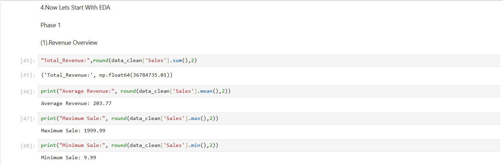
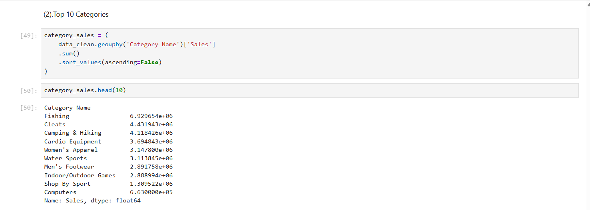
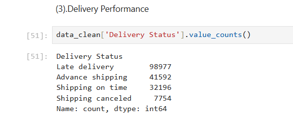
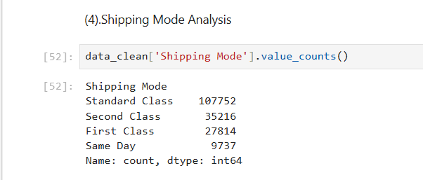
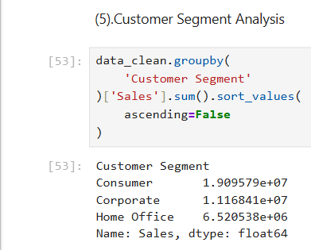
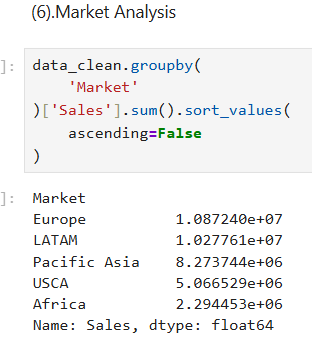
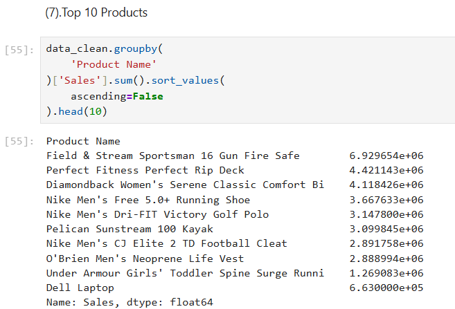

# 📦 Supply Chain Analytics Dashboard

A complete end-to-end Supply Chain Analytics project built using **Python** and **Power BI** to analyze sales performance, inventory movement, and logistics efficiency.

---

# 🚀 Project Overview

This project transforms raw supply chain data into actionable business insights through data cleaning, exploratory data analysis (EDA), and interactive dashboards.

---

# 🛠 Tools Used

| Tool | Purpose |
|--------|---------|
| Python | Data Cleaning & Feature Engineering |
| Pandas | Data Manipulation |
| NumPy | Numerical Operations |
| Matplotlib | Data Visualization |
| Seaborn | Exploratory Data Analysis |
| Power BI | Dashboard Development |

---

# 📂 Dataset

### DataCo Smart Supply Chain Dataset

Dataset Link:

https://www.kaggle.com/datasets/shashwatwork/dataco-smart-supply-chain-for-big-data-analysis

---

# 📋 Project Workflow

## 1. Data Cleaning using Python

- Handled Missing Values
- Removed Duplicates
- Converted Date Columns
- Feature Engineering

Created:

- Delivery_Delay
- Order_Year
- Order_Month
- Order_Quarter

---

## 2. Star Schema Modeling

Created:

### Fact Table

- Fact_Orders

### Dimension Tables

- Dim_Product
- Dim_Customer
- Dim_Date

---

## Model View


---

## 3. Exploratory Data Analysis (EDA)

### Revenue Overview

- Total Revenue
- Average Revenue
- Maximum Sales
- Minimum Sales



---

### Top Categories Analysis



---

### Delivery Performance Analysis



---

### Shipping Mode Analysis



---

### Customer Segment Analysis



---

### Market Analysis



---

### Top Products Analysis



---

# 📊 Power BI Dashboards

---

# 📈 Performance Monitoring Dashboard

Provides a high-level overview of:

- Revenue Trends
- Category Performance
- Customer Segments
- KPI Monitoring

### Dashboard Preview


---

# 📊 Sales Analytics Dashboard

Analyzes:

- Top Products
- Revenue by Category
- Department Performance
- Customer Segment Contribution

### Dashboard Preview


---

# 📦 Inventory Management Dashboard

Monitors:

- Product Demand
- Fast Moving Products
- Slow Moving Products
- Category Demand Distribution

### Dashboard Preview


---

# 🚚 Logistics & Delivery Performance Dashboard

Tracks:

- Average Delivery Delay
- Late Delivery %
- Shipping Mode Distribution
- Delivery Delay Trend
- Late Delivery Risk

### Dashboard Preview


---

# 📈 Key Insights

### Revenue

- Total Revenue: **$36.78M**
- Total Profit: **$3.97M**

### Customer Segment

Consumer customers generated the highest revenue contribution.

### Category Performance

Fishing category contributed the highest revenue.

### Logistics

54.83% of orders experienced late deliveries.

### Shipping Mode

Standard Class was the most frequently used shipping method.

### Inventory

Several products exhibited slow-moving behavior, indicating optimization opportunities.

---

# 📁 Repository Structure

```text
Supply-Chain-Analytics/
│
├── Dataset/
│
├── Python/
│     ├── Supply_Chain_EDA.ipynb
│     ├── Data_Cleaning.ipynb
│
├── Power BI/
│     ├── Supply_Chain_Analytics.pbix
│
├── Images/
│     ├── Performance Monitoring.png
│     ├── Sales Analytics.png
│     ├── Inventory Management.png
│     ├── Logistic Performance.png
│     ├── Supply Chain Model View.png
│     ├── EDA 1.png
│     ├── EDA 2.png
│     ├── EDA 3.png
│     ├── EDA 4.png
│     ├── EDA 5.png
│     ├── EDA 6.png
│     └── EDA 7.png
│
├── README.md
│
└── requirements.txt
```

---

# ⚡ Future Enhancements

- Demand Forecasting
- Delivery Delay Prediction
- Inventory Optimization
- Customer Segmentation using Machine Learning
- Real-Time Dashboard Integration

---

# 👨‍💻 Author

**Gargeya Kharat**

---

⭐ If you found this project useful, please consider giving it a star!
